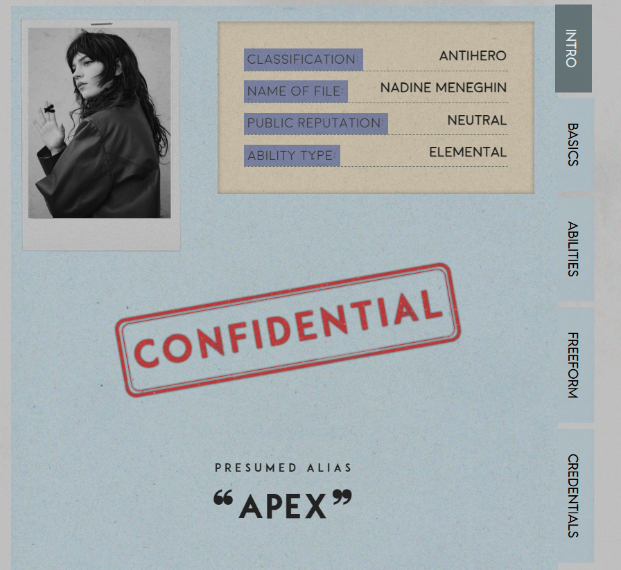

# Profile Layout UI Component

A responsive profile layout built with HTML, CSS, and JavaScript featuring tabbed navigation and modular content sections.

## Overview

This project demonstrates a reusable profile layout designed to display structured user or character information in a clean, organized interface. The layout emphasizes readability, responsiveness, and maintainable frontend architecture.

## Features

- Semantic HTML structure
- Tabbed content navigation using vanilla JavaScript
- Responsive layout for desktop and mobile
- Clean separation of HTML, CSS, and JavaScript
- Easily extendable content sections

## Problem Solved

Profiles often contain large amounts of information that become difficult to read when presented in a single vertical layout.

## Solution

Implemented a tab-based navigation system that segments content into logical sections, improving usability and reducing visual clutter without requiring page reloads.

## Tech Used

- HTML5  
- CSS3  
- JavaScript (DOM manipulation, event handling)

## Project Structure

profile-layout/
├── index.html
├── styles.css
├── script.js
├── assets/
└── README.md

## Notes

This layout was originally developed for a CMS-based platform with templating constraints and later adapted into a standalone frontend component for portfolio demonstration.
